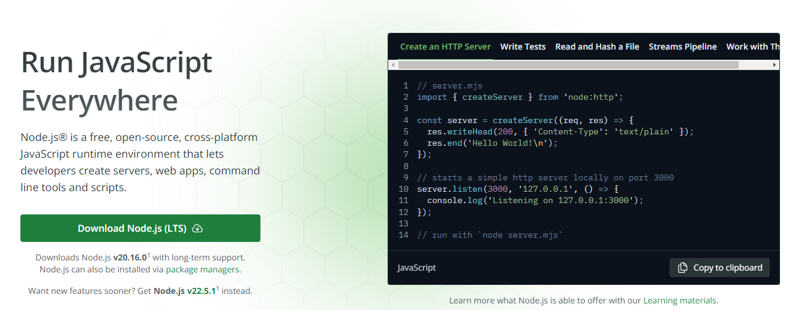
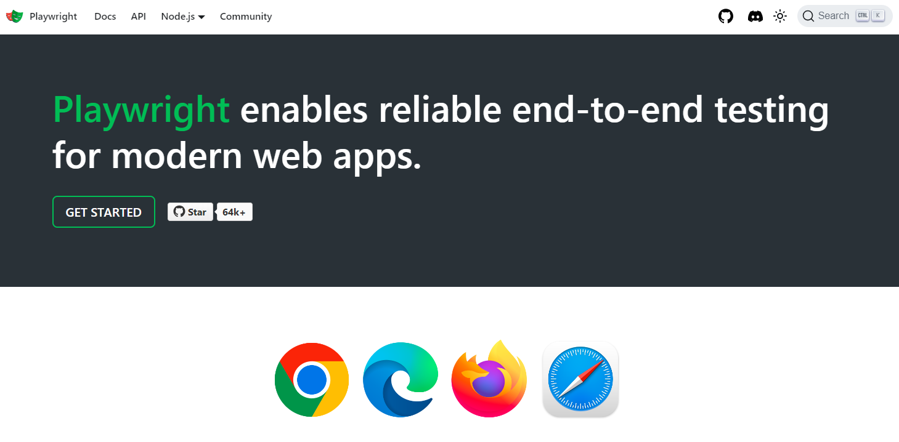
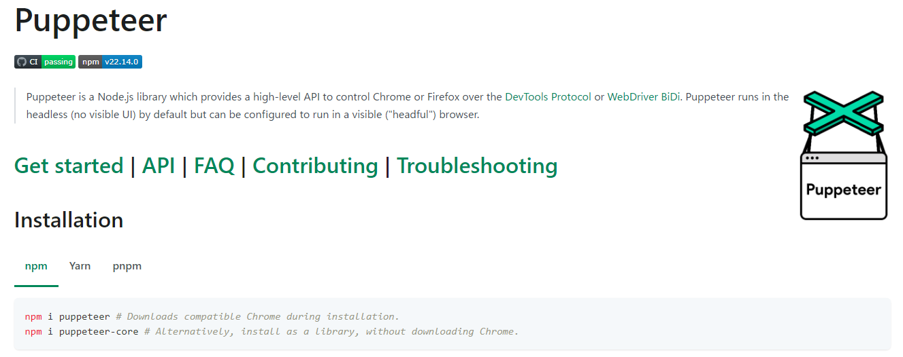

# 動作環境について

Node.js で動作するので、Windows,Linux,mac など、どこでも動作するはず。

※Windows10,11,Ubuntu24.04 での動作は確認済み。

## Node.js のインストール

[Node.js — Run JavaScript Everywhere](https://nodejs.org/en)

公式サイトからLTS版(今時点では v20.16.0 )をインストールしてください。

## playwright について

ブラウザを自動操作するツールはいろいろ選択肢がありますが、TypeScript で細かく自動操作できるようになった結果、今では E2E テストツールとして広く使われるようになっています。

以前は、同様な自動操作ができる Puppeteer を JavaScript で利用していましたが、流行にのっかって、playwright と TypeScript を触ってみることにしました。

さよなら、Puppeteer、、
