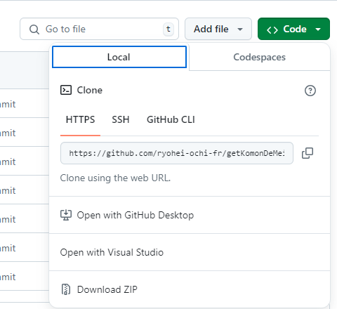

# ネットde顧問の給与明細書を全部ダウンロードするぞ

2024/7/31で契約が切れる前に、給与明細書を取得しておこう

## 概要

後で書くから(ry..

## 動作環境

- Node.js
- playwright
- gitコマンド ※1

Node.js のインストールについては、[こちら](install.md)。

もしくはググってください。

※1 gitコマンドに関しては必須ではなく、プロジェクトを ZIP でダウンロードしても問題ないです。



## 実行方法

powershellやコマンドラインで、以下のコマンドを実行するだけです。

```ps
git clone https://github.com/ryohei-ochi-fr/getKomonDeMeisai.git
cd getKomonDeMeisai
npm install
cd backend
npx ts-node index.ts ネットde顧問のID パスワード
```

給与明細書は、`download`以下にネットde顧問のID毎のフォルダに作成されます。

## おまけ

ヘッドレス(ブラウザの非表示)で実行も可能ですが、今回はあえて false にしてます。

Ubuntuで動作を確認したときはもちろん`false`のヘッドレスモード。

AWS の Ubunthu で、X-Window などインストールしなくても、SSH したコンソールから、ヘッドレスでブラウザが動いているという不思議、不思議。

```Typescript
  const browser = await chromium.launchPersistentContext(userDataDir,{
    // headless: true, // 非表示
    headless: false, // 表示
    slowMo: 500,
  });
```

## 参考情報

[初心者からずっと使い続けたいPlaywrightスクリプトチートシート #自動テスト - Qiita](https://qiita.com/yurihyp/items/c538bc667e68dcbfff03)

[Playwright コードスニペット #TypeScript - Qiita](https://qiita.com/jyoppomu/items/fab53e0b579d3f18c5ef)

[List of Chromium Command Line Switches « Peter Beverloo](https://peter.sh/experiments/chromium-command-line-switches/)

